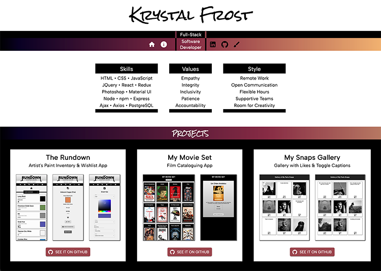

# Hello!

I'm Krystal Frost.  This project is my personal website to showcase software engineering projects.

The deployed site can be visited [Here!](https://www.krystalfrost.com/)

## Screenshot

## Prerequisites

This app was built with Node, React, and Material UI (and a full list of dependencies can be found in `package.json`).

Before you get started, make sure you have the following software installed on your computer:

- [Node.js](https://nodejs.org/en/)
- [Nodemon](https://nodemon.io/)

## Install Instructions

- Run `npm install`
- Run `npm run server`
- Run `npm run client`
- Navigate to `localhost:3000` in your browser.

## Usage

The first section of the homepage shows my professional skills, values, and work style.

The second section on /home showcases some of my (other) favorite projects. The buttons can be clicked to go to the GitHub repos.

On the left side of the nav bar, there are white internal navigation icons for /home and /about. Click the second to go to /about where you will find a short bio and a fun bonus: the "Random Thing I Like Generator"! Click the button on the generator to see a randomly generated thing I like.

On the right side of the nav bar, black icons link to external locations: my LinkedIn profile, my GitHub profile, and a paintbrush icon which links to this project's sister site, which features my artwork.

## Contributors
Krystal Frost

## License
This project is licensed under the MIT License - see the LICENSE.md file for details.

## Acknowledgments
Thanks to Prime Digital Academy, and especially to my instructor, Casie Siekman.